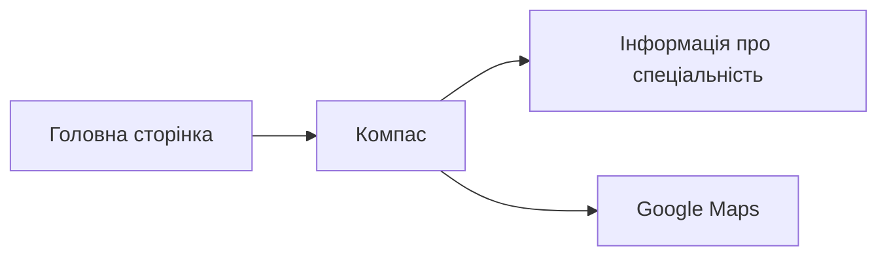
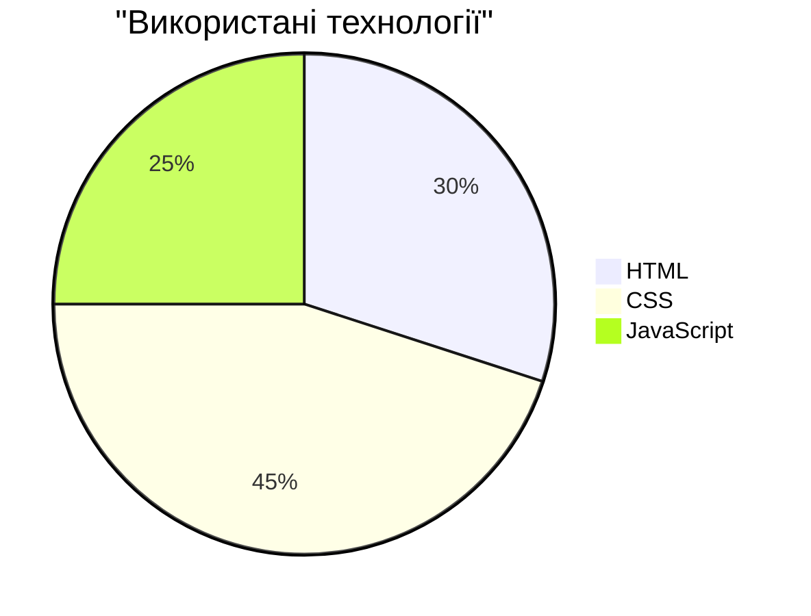

# Навігаційний сайт для спеціальності "Розробка програмного забезпечення"

## 📱 Опис проекту

Цей проект складається з двох основних компонентів:
1. Навігаційний компас для знаходження аудиторії 221
2. Інформаційна сторінка про спеціальність



## 🗺️ Функціональність навігації

| Функція | Опис |
|---------|------|
| GPS відстеження | Показує відстань до цілі в метрах |
| Компас | Динамічно оновлює напрямок руху |
| Підказки | З'являються при наближенні до ключових точок |
| Карта | Швидкий доступ до Google Maps |

## 💻 Технології



## 📚 Структура сайту про спеціальність

| Розділ | Зміст |
|--------|--------|
| Про спеціальність | Основна інформація |
| Переваги | Практичні навички, перспективи, викладачі |
| Заклик до дії | Посилання на детальну інформацію |

## 🎯 Напрямки навчання

- [x] Сучасні мови програмування
- [x] Веб-розробка
- [x] Мобільна розробка
- [x] Бази даних
- [x] Тестування ПЗ

## 🎨 Кольорова схема

```
Основні кольори:
#9b472b - Коричневий (акцент)
#f0e8d8 - Бежевий (фон)
#252b29 - Темно-сірий (текст)
```
